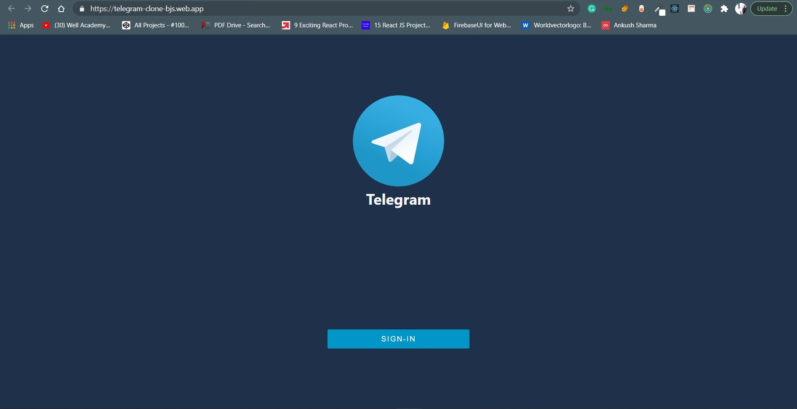
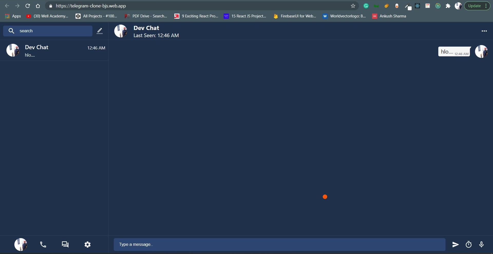

# Telegram Clone - React & Redux

## Google Authentication

### Telegram Clone Login



### Telegram Clone Home



## Tech Used:

1. [Create React Redux App](https://github.com/reduxjs/cra-template-redux) -- for creating the Template of the Project.
2. [Firebase](https://github.com/firebase) -- For Realtime Database and Deployment of the Project.
3. [material-ui](https://github.com/mui-org/material-ui) -- For Some PreBuilt Components and Icons.
4. [redux-toolkit](https://github.com/reduxjs/redux-toolkit) - Redux is generally used for state management.
5. [node-sass](https://github.com/sass/node-sass) - node-sass natively compiles .scss files to css files
6. [react-flip-move](https://github.com/joshwcomeau/react-flip-move) - This animates the messages.
7. [moment](https://github.com/moment/moment) - moment is js library for manipulating, and formatting dates.

## Installation

```
npm install
```

## Update Firebase Config File with your Firebase Config

## Start The App

```
npm start
```

## Build The Project

```
npm run build
```
